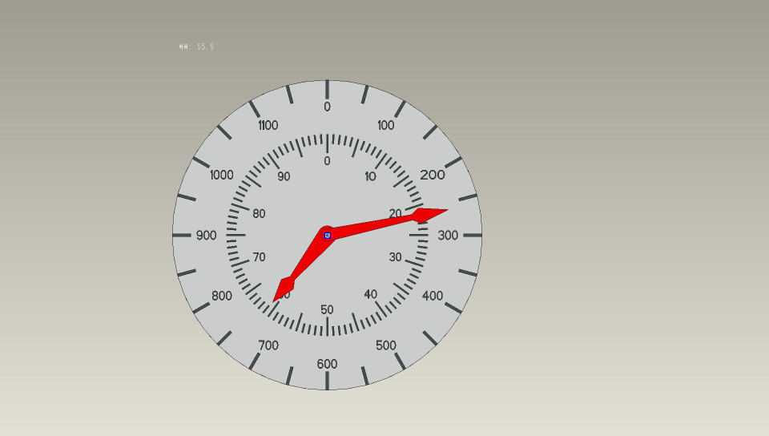
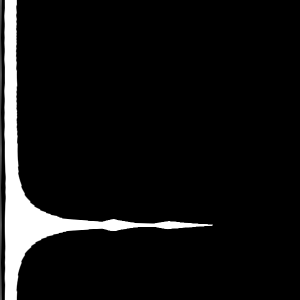

## 算法说明

首先利用外接矩形找出圆心,坐标为(815,517)



然后以圆心为坐标做径向求和确定长短指针的角度



运行RGSplus.py得到结果
运行build_testData.py得到测试集
运行test.py得到准确率

## 源码

**RGSplus.py:**
```python
import cv2 as cv
import numpy as np
import math
from matplotlib import pyplot as plt
import os

def ChangeImage(image):
    """
    初步处理图像
    """
    # 指针提取
    mask = extract_red(image)
    mask = cv.medianBlur(mask,ksize=5)#去噪
    # 获取中心
    center = get_center(mask)
    # 去除多余黑色边框
    [y, x] = center
    cut = mask[y-300:y+300, x-300:x+300]
    # 因为mask处理后已经是二值图像，故不用转化为灰度图像
    return cut

def extract_red(image):
    """
    通过红色过滤提取出指针
    """
    red_lower1 = np.array([0, 43, 46])
    red_upper1 = np.array([10, 255, 255])
    red_lower2 = np.array([156, 43, 46])
    red_upper2 = np.array([180, 255, 255])
    dst = cv.cvtColor(image, cv.COLOR_BGR2HSV)
    mask1 = cv.inRange(dst, lowerb=red_lower1, upperb=red_upper1)
    mask2 = cv.inRange(dst, lowerb=red_lower2, upperb=red_upper2)
    mask = cv.add(mask1, mask2)
    return mask

def get_center(image):
    """
    获取钟表中心
    """ 
    edg_output = cv.Canny(image, 100, 150, 2)
    # 获取图片轮廓
    contours, hireachy = cv.findContours(edg_output, cv.RETR_TREE, cv.CHAIN_APPROX_SIMPLE)
    center = []
    cut=[0, 0]
    for i, contour in enumerate(contours):
        x, y, w, h = cv.boundingRect(contour)  # 外接矩形
        area = w * h  # 面积
        if area < 100 or area > 4000:
            continue
        cv.rectangle(image, (x, y), (x + w, y + h), (255, 0, 0), 1)
        cx = w / 2
        cy = h / 2
        cv.circle(image, (np.int(x + cx), np.int(y + cy)), 1, (255, 0, 0))
        center = [np.int(x + cx), np.int(y + cy)]
        break
    return center[::-1]

def RGS(image):
    """
    求径向灰度和并画图
    """
    
    polarimg = polar(image)
    psum = polarimg.sum(axis=1, dtype = 'int32')
    result = Get_Reading(list(psum))
    return result

def Get_Reading(sumdata):
    """
    读数并输出
    """
    peak = []
    # s记录遍历时波是否在上升
    s = sumdata[0] < sumdata[1]
    for i in range(599):
        # 上升阶段
        if s==True and sumdata[i] > sumdata[i+1] and sumdata[i] > 70000:
            peak.append(sumdata[i])
            s=False
        # 下降阶段
        if s==False and sumdata[i] < sumdata[i+1]:
            s=True
    peak.sort()
    a = sumdata[0]
    b = sumdata[-1]
    if not peak or max(a,b) > peak[-1]:
        peak.append(max(a,b))
    longindex = (sumdata.index(peak[-1]))%599
    longnum = (longindex + 1)//25*50
    # 先初始化和长的同一刻度
    #shortindex = longindex
    shortnum = round(longindex / 6)
    try:
        shortindex = sumdata.index(peak[-2])
        shortnum = round(shortindex / 6)
    except IndexError:
        i=0
        while i<300:
            i += 1
            l = sumdata[(longindex-i)%600]
            r = sumdata[(longindex+i)%600]
            possibleshort = max(l,r)
            # 在短指针可能范围内寻找插值符合条件的值
            if possibleshort > 80000:
                continue
            elif possibleshort < 60000:
                break
            else:
                if abs(l-r) > 17800:
                    shortindex = sumdata.index(possibleshort) - 1
                    shortnum = round(shortindex / 6)
                    break
    return [longnum,shortnum%100]

def polar(image):
    """
    转换成极坐标
    """
    x, y = 300, 300
    maxRadius = 300*math.sqrt(2)
    linear_polar = cv.linearPolar(image, (y, x), maxRadius, cv.WARP_FILL_OUTLIERS + cv.INTER_LINEAR)
    mypolar = linear_polar.copy()
    #将图片调整为从0度开始
    mypolar[:150, :] = linear_polar[450:, :]
    mypolar[150:, :] = linear_polar[:450, :]
    cv.imshow("linear_polar", mypolar)
    return mypolar

def RGStest():
    """
    RGS法测试
    """
    f = open('./result.txt', 'w')
    for i in range(1001):
        image = cv.imread("./BONC/1_{0:0>4d}".format(i) + ".jpg")
        newimg = ChangeImage(image)
        result = RGS(newimg)
        f.writelines("1_{0:0>4d}".format(i)+".jpg     " + " 长指针读数：" + str(result[0])+"     "+" 短指针读数：" + str(result[1])+'\n')
    f.close()

if __name__ == "__main__":
    t1 = cv.getTickCount()
    RGStest()
    t2 = cv.getTickCount()
    # 打印用时
    print("time:%fs"%((t2-t1)/cv.getTickFrequency()))   
```

**build_testData.py:**

```python
f = open('test.txt', 'w')
a, b = -50, -1 # 长短指针初始读数
for i in range(1001):
    if int(i % 19) == 0:
        a = a + 50 if a // 1150 != 1 else 0 
    if int(i % 9.12) == 0:
        b = b + 1 if b // 99 != 1 else 0
    name = '1_{0:0>4d}.jpg     长指针读数：{1}     短指针读数：{2}\n'.format(i, a, b)
    f.write(name)
f.close()
```

**test.py:**

```python
f1 = open('test.txt', 'r')
f2 = open('result.txt', 'r')
false = 0
for i in range(1001):
    r1 = f1.readline().split('数')
    r2 = f2.readline().split('数')
    try:
        if (r1[1][1:5] != r2[1][1:5] and (int(r1[1][1:5]) + 50) % 1200 != int(r2[1][1:5])) or (r1[2][1:3] != r2[2][1:3] and (int(r1[2][1:3]) + 1) % 100 != int(r2[2][1:3])):
            false += 1
            print('1_{0:0>4d}.jpg 出错！'.format(i))
    except:
        false += 1

print('错误率%f' % float(false/1001))
f1.close()
f2.close()

```
## 准确率
结果保存在result.txt中
测试文件为test.txt中
由测试结果知准确率为100％